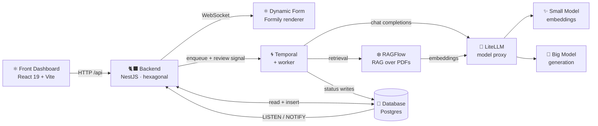
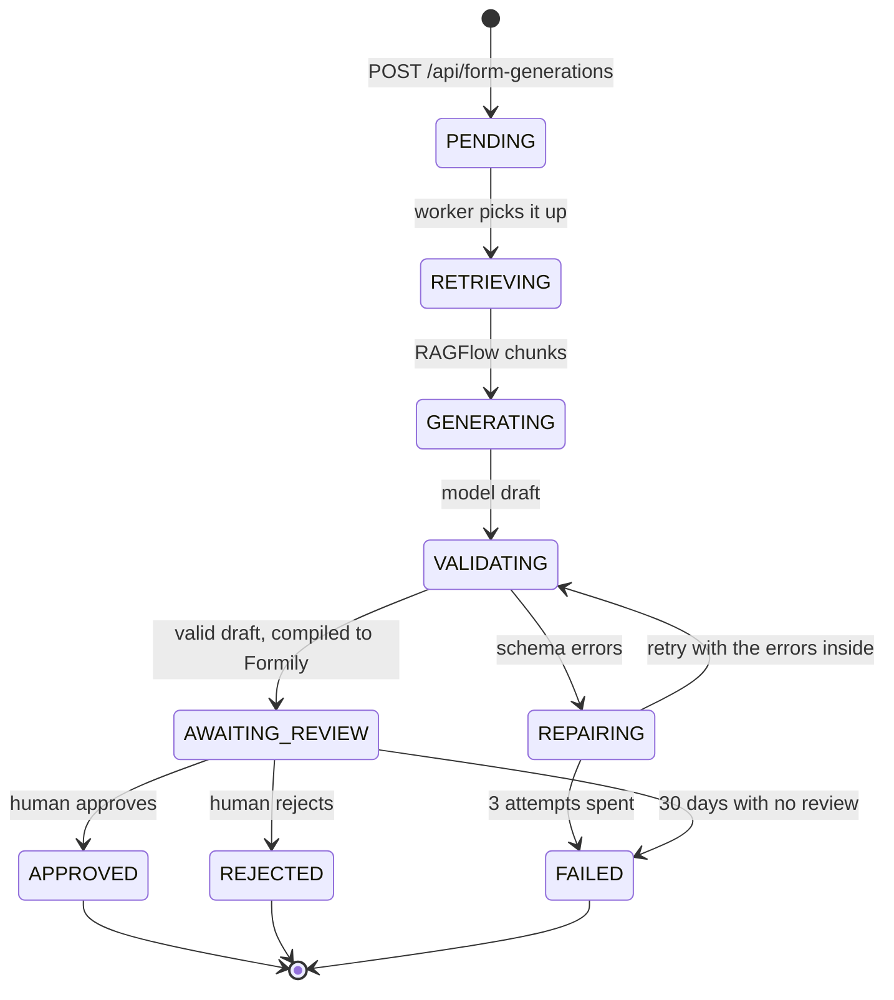

# AI Form Creator

Generates regulatory forms with AI, grounded on the regulations you upload, and
**never publishes one without a person approving it**.

You describe the form you need in plain language and pick which regulatory
documents it should lean on. A Temporal workflow retrieves the relevant chunks
from RAGFlow, asks a model for a draft over a closed field vocabulary, validates
that draft against a shared schema (retrying with the errors inside when it does
not fit), compiles it into Formily JSON and then **stops** and waits for a human
verdict. The screen follows the whole thing live over a WebSocket.

## System architecture



The arrows that matter and are easy to miss:

- **The back never writes a status.** It writes the `PENDING` row and enqueues.
  From there on, the only writer is the worker. The back finds out through
  Postgres `LISTEN`/`NOTIFY` and relays it over the WebSocket.
- **The worker never reads the database.** Everything it needs travels in the
  workflow argument, so the generation stays tied to the documents that existed
  at request time.
- **No API key ever reaches the browser.** The front talks to the back; only the
  worker and RAGFlow talk to LiteLLM, and only LiteLLM talks to the providers.

### The path of a generation



`AWAITING_REVIEW` is not a formality: the only transition towards `APPROVED`
starts there and a person triggers it. Three things hold that up — the
workflow's `condition`, the 409 of the `ReviewFormGeneration` use case, and the
back's repository port having no `update` at all.

## Packages

| Package                                     | What it is                                                                                                                                                                                                    |
| ------------------------------------------- | ------------------------------------------------------------------------------------------------------------------------------------------------------------------------------------------------------------ |
| [`apps/front`](./apps/front)                | React 19 + Vite 8. Dynamic forms from JSON Schema with [Formily](https://formilyjs.org/), [bulletproof-react](https://github.com/alan2207/bulletproof-react/tree/master/apps/react-vite) architecture           |
| [`apps/back`](./apps/back)                  | NestJS + Prisma + Postgres. Document ingestion, generation requests, WebSocket fan-out. Hexagonal architecture                                                                                                  |
| [`apps/worker`](./apps/worker)              | Temporal worker. The only process talking to the model and the only one moving a generation's status                                                                                                           |
| [`packages/contracts`](./packages/contracts) | TypeBox schemas that cross the wire — HTTP, the Temporal queue and the WebSocket. One definition, three consumers                                                                                              |

All four architectures are **enforced by ESLint**: breaking them fails the lint
and blocks the commit. The coding rules (naming, magic strings, design tokens,
variant mapping) are in [`CLAUDE.md`](./CLAUDE.md). The tasks that need a human
(credentials, a real backend) are in [`HUMAN-TASK.md`](./HUMAN-TASK.md).
Infrastructure lives in [`iac/`](./iac/README.md).

## Running it locally

### 0. Compile the contracts (always first)

The apps type against the package's `dist/`, which is not committed. In a fresh
clone, nothing else compiles until this runs:

```bash
cd packages/contracts
npm install
npm run build
```

### 1. Front only, no backend (the fastest way in)

The API is mocked with MSW, including a simulated generation pipeline that walks
through every status. Enough to work on the whole UI:

```bash
cd apps/front
cp .env.example .env      # VITE_APP_ENABLE_API_MOCKING=true
npm install
npm run dev               # http://localhost:3000
```

Routes: `/`, `/forms`, `/forms/:formTemplateId`, `/regulatory-documents`,
`/form-generations`, `/form-generations/:formGenerationId`.

### 2. The full stack

Four dependencies have to be reachable: Postgres, Temporal, LiteLLM and RAGFlow.
The cluster in [`iac/`](./iac/README.md) runs all four; locally the practical
route is to port-forward the ones that are already deployed and bring RAGFlow up
from its own Docker Compose checkout.

```bash
# Postgres, Temporal and LiteLLM from the cluster
kubectl -n ai-form-creator port-forward svc/app-postgres    5432:5432 &
kubectl -n ai-form-creator port-forward svc/temporal-server 7233:7233 &
kubectl -n ai-form-creator port-forward svc/litellm         4000:4000 &

# RAGFlow from the local checkout — see RAGFLOW-STARTUP.md
cd ragflow/ragflow/docker && docker compose -f docker-compose.yml up -d
```

Then the backend, in its own terminal:

```bash
cd apps/back
cp .env.example .env      # fill in the credentials — see HUMAN-TASK.md
npm install
npm run db:deploy         # applies the migrations
npm run dev               # http://localhost:8080 — Swagger at /docs
```

And the worker, in another one:

```bash
cd apps/worker
cp .env.example .env      # LITELLM_API_KEY, RAGFLOW_API_KEY, DATABASE_URL
npm install
npm run dev               # it listens on no port: it takes work from the queue
```

Finally, point the front at the real backend:

```bash
cd apps/front
# in .env:
#   VITE_APP_API_URL=http://localhost:8080/api
#   VITE_APP_ENABLE_API_MOCKING=false
npm run dev
```

To watch what a generation is doing when it gets stuck, the Temporal UI is the
place: `kubectl -n ai-form-creator port-forward svc/temporal-ui-svc 8080:8080`.

### Ports at a glance

| Service          | Local port | In the cluster          |
| ---------------- | ---------- | ----------------------- |
| Front (Vite)     | 3000       | `front` behind Traefik  |
| Back (Nest)      | 8080       | `back:80`, path `/api`  |
| Postgres (app)   | 5432       | `app-postgres:5432`     |
| Temporal         | 7233       | `temporal-server:7233`  |
| LiteLLM          | 4000       | `litellm:4000`          |
| RAGFlow API      | 9380       | `ragflow:9380`          |
| RAGFlow UI       | 9797       | `ragflow` (Ingress)     |

## Commands

Every package exposes the same set. Run them from the package folder:

| Command               | What it does                              |
| --------------------- | ----------------------------------------- |
| `npm run dev`         | development server / worker in watch mode |
| `npm run lint`        | ESLint (architecture, naming, tokens)     |
| `npm run lint:fix`    | ESLint + Prettier autofix                 |
| `npm run check-types` | `tsc`                                     |
| `npm test`            | Vitest (front) / Jest (back, worker)      |
| `npm run build`       | production build                          |

Front only: `npm run generate` (Plop scaffolding for a feature/component).
Back only: `npm run db:migrate | db:deploy | db:studio`.

Git hooks (husky): `pre-commit` runs lint-staged; `pre-push` runs types + tests
across all four packages, with the contracts rebuilt first.

## Stack

| Layer            | Choice                                             |
| ---------------- | -------------------------------------------------- |
| Build (front)    | Vite 8 + `@vitejs/plugin-react`                    |
| Forms            | `@formily/core` + `@formily/react` (schema-driven) |
| Data (front)     | TanStack Query 5 + axios + socket.io-client        |
| Routing          | react-router 8 (`createBrowserRouter`, lazy)       |
| Styling          | Tailwind v4 (design tokens in `@theme`) + CVA      |
| Global state     | Zustand (notifications only, for now)              |
| API              | NestJS 11 + Prisma 6 + Postgres                    |
| Orchestration    | Temporal (durable workflows, 30-day waits)         |
| Models           | LiteLLM as a proxy (OpenAI-compatible API)         |
| RAG              | RAGFlow (MySQL + Elasticsearch + MinIO + Redis)    |
| Contracts        | TypeBox (`Static<>` types + runtime schemas)       |
| Env validation   | Zod                                                |
| Mocks            | MSW (dev + tests)                                  |
| Quality          | ESLint 9 flat config, Prettier, Vitest/Jest, husky |
| Infrastructure   | Kustomize over k3s (see [`iac/`](./iac/README.md)) |

## How the architecture is enforced

`eslint.config.js` reads `src/features/` **from disk** and generates the
restricted zones, so every new feature is isolated automatically:

- `import-x/no-restricted-paths` + `no-restricted-imports`: they forbid imports
  between features and guarantee the `shared → features → app` flow.
- `check-file/*`: files and folders in `kebab-case`.
- `@typescript-eslint/naming-convention`: camelCase/PascalCase/UPPER_CASE.
- `no-restricted-syntax`: forbids comparing against string literals, literal
  routes in `<Link to>`, literal storage keys and `import.meta.env` outside
  `src/config`.
- `@typescript-eslint/no-magic-numbers`: numbers go to `config/`.

The back and the worker have their own equivalents: dependencies pointing
inwards (`domain` ← `application` ← `infrastructure`) and, in the worker, the
ban on `workflows/` touching activities, config or any Node module — the
deterministic sandbox would break in production, not at compile time.

A real example of what the lint rejects:

```
error  Unexpected path "../../dynamic-form/utils/…" imported in restricted zone.
       Imports between features are not allowed.        import-x/no-restricted-paths
error  Magic string: compare against a named constant.        no-restricted-syntax
error  The filename "Bad-Example.tsx" does not match KEBAB_CASE.
                                        check-file/filename-naming-convention
```

---

# Complete example: the `dynamic-form` feature

This is the reference feature. It renders **any** form out of the JSON Schema
the API returns: there is no component per form, there is one renderer and a
catalogue of fields.

```
src/features/dynamic-form/
├── api/
│   ├── get-form-templates.ts      # list    (queryOptions + hook)
│   ├── get-form-template.ts       # detail  (includes the schema)
│   └── submit-form-response.ts    # submission mutation
├── components/
│   ├── dynamic-form.tsx           # renderer: createForm + FormProvider + SchemaField
│   ├── schema-field.tsx           # Variant Mapping: 'TextField' → <TextField/>
│   ├── form-item.tsx              # decorator: label, required, help, errors
│   ├── form-status-badge.tsx
│   ├── form-templates-list.tsx
│   ├── form-template-detail.tsx   # composes query + renderer + mutation
│   ├── fields/                    # controls connected to Formily
│   │   ├── field-styles.ts        # shared CVA (tokens)
│   │   ├── text-field.tsx  textarea-field.tsx  number-field.tsx
│   │   ├── select-field.tsx  radio-group-field.tsx
│   │   ├── checkbox-field.tsx  date-field.tsx
│   └── __tests__/dynamic-form.test.tsx
├── config/
│   ├── api-endpoints.ts           # URLs + query keys (zero literals outside)
│   ├── field-components.ts        # `x-component` names (the contract)
│   ├── form-status.ts             # status Variant Mapping
│   └── validation-locale.ts       # validation messages
├── types/form-template.ts
└── utils/normalize-form-values.ts
```

## Step by step: how it was built (and how to build the next one)

### 0. Generate the skeleton

```bash
npm run generate      # → feature → name: dynamic-form, entity: form-template
```

It leaves `config/api-endpoints.ts`, `types/`, `api/` and a list component
created and already formatted. From that moment on ESLint stops another feature
from importing it.

### 1. Types: the contract with the backend (`types/form-template.ts`)

The schema is data, not code. It is typed with Formily's `ISchema`:

```ts
import type { ISchema } from '@formily/react';

export const formTemplateStatuses = {
  draft: 'draft',
  published: 'published',
  archived: 'archived',
} as const;
export type FormTemplateStatus =
  (typeof formTemplateStatuses)[keyof typeof formTemplateStatuses];

export type FormTemplate = FormTemplateSummary & { schema: ISchema };
```

> The statuses are declared as an `as const` object, not as a union of loose
> strings: that way `formTemplateStatuses.published` replaces `'published'`
> everywhere and the lint can forbid the literal comparison.

### 2. Centralized configuration (`config/`)

No URLs and no component names scattered around:

```ts
// config/api-endpoints.ts
export const dynamicFormEndpoints = {
  formTemplates: '/form-templates',
  formTemplate: (id: string) => `/form-templates/${id}`,
  formResponses: (id: string) => `/form-templates/${id}/responses`,
} as const;

export const dynamicFormQueryKeys = {
  all: ['form-templates'] as const,
  lists: () => [...dynamicFormQueryKeys.all, 'list'] as const,
  detail: (id: string) => [...dynamicFormQueryKeys.all, 'detail', id] as const,
} as const;
```

```ts
// config/field-components.ts — the contract between the JSON and React.
// The list itself lives in packages/contracts: since the AI is the one
// choosing the `x-component`, these are literals crossing the wire.
export const formFieldComponents = {
  text: 'TextField',
  textarea: 'TextareaField',
  number: 'NumberField',
  select: 'SelectField',
  checkbox: 'CheckboxField',
  radioGroup: 'RadioGroupField',
  date: 'DateField',
} as const;
```

### 3. API layer (`api/`)

One file per operation; pure function + `queryOptions` + hook:

```ts
export const getFormTemplate = (
  formTemplateId: string,
): Promise<FormTemplate> =>
  api.get(dynamicFormEndpoints.formTemplate(formTemplateId));

export const getFormTemplateQueryOptions = (formTemplateId: string) =>
  queryOptions({
    queryKey: dynamicFormQueryKeys.detail(formTemplateId),
    queryFn: () => getFormTemplate(formTemplateId),
  });

export const useFormTemplate = ({
  formTemplateId,
  queryConfig,
}: UseFormTemplateOptions) =>
  useQuery({ ...getFormTemplateQueryOptions(formTemplateId), ...queryConfig });
```

Separating the function from its hook allows preloading from a route
`clientLoader` (`src/app/routes/forms/forms.tsx` does exactly that).

### 4. The fields: connecting our own components to Formily (`components/fields/`)

Formily imposes no UI library. `connect` injects `value`, `onChange`,
`disabled`; `mapProps` translates field state into component props:

```tsx
const TextInput = ({ value, invalid, className, ...props }: TextInputProps) => (
  <input
    type="text"
    value={value ?? ''}
    className={cn(controlVariants({ invalid }), className)}
    {...props}
  />
);

export const TextField = connect(
  TextInput,
  mapProps((props, field) => ({
    ...props,
    invalid: Boolean('selfErrors' in field && field.selfErrors?.length),
  })),
);
```

Details already solved:

- `select`: `mapProps({ dataSource: 'options' })` turns the JSON Schema `enum`
  into the `options` of the `<select>`.
- `checkbox`: Formily reads `event.target.value` (which on a native checkbox is
  `"on"`), so the component emits the boolean explicitly.
- Styles: everything comes from `controlVariants` (CVA + design tokens), no raw
  values.

### 5. The `FormItem` decorator (`components/form-item.tsx`)

It wraps every field with a label, a required marker, help and errors, reading
the field's reactive state:

```tsx
export const FormItem = observer(({ children, help, className }: FormItemProps) => {
  const field = useField<Field>();
  const errors = field.selfErrors ?? [];
  …
});
```

### 6. Variant Mapping of the renderer (`components/schema-field.tsx`)

The only place where a schema string becomes a component. No `switch`, no `if`:

```tsx
export const SchemaField = createSchemaField({
  components: {
    [formFieldDecorators.formItem]: FormItem,
    [formFieldComponents.text]: TextField,
    [formFieldComponents.select]: SelectField,
    …
  },
});
```

**Adding a new field type** (a slider, say) = 3 steps, touching nothing else:
constant in `packages/contracts` → component in `fields/` → entry in this map.

### 7. The renderer (`components/dynamic-form.tsx`)

```tsx
export const DynamicForm = ({
  schema,
  initialValues,
  isDisabled,
  onSubmit,
}: DynamicFormProps) => {
  const form = useMemo(
    () => createForm({ initialValues, editable: !isDisabled }),
    [initialValues, isDisabled],
  );

  const handleSubmit = () => {
    form.submit<FormValues>(onSubmit).catch(() => undefined); // validates before calling
  };

  return (
    <FormProvider form={form}>
      <SchemaField schema={schema} />
      <Button
        onClick={handleSubmit}
        isLoading={isSubmitting}
        disabled={isDisabled}
      >
        …
      </Button>
    </FormProvider>
  );
};
```

It knows no concrete field: it is reusable for any schema. The generation review
screen renders the very same component in preview mode.

### 8. Composition with data (`components/form-template-detail.tsx`)

It joins query + renderer + mutation, and uses the status Variant Mapping to
decide whether the form can be submitted:

```tsx
const statusVariant = formStatusVariants[formTemplate.status];

<DynamicForm
  schema={formTemplate.schema}
  isDisabled={!statusVariant.isSubmittable}
  isSubmitting={submitFormResponse.isPending}
  onSubmit={(values) =>
    submitFormResponse.mutate({
      formTemplateId,
      values: normalizeFormValues(values),
    })
  }
/>;
```

### 9. Wiring the feature into the app (the `app/` layer)

`src/config/paths.ts`:

```ts
forms: {
  root:   { path: '/forms', getHref: () => '/forms' },
  detail: { path: '/forms/:formTemplateId',
            getHref: (id: string) => `/forms/${id}` },
},
```

`src/app/routes/forms/form.tsx` — the route is what imports the feature (never
the other way around):

```tsx
const FormRoute = () => {
  const { formTemplateId } = useParams<{ formTemplateId: string }>();
  if (!formTemplateId) return null;
  return (
    <AppLayout>
      <FormTemplateDetail formTemplateId={formTemplateId} />
    </AppLayout>
  );
};
export default FormRoute;
```

and it is registered in `src/app/router.tsx` with
`lazy: () => import('./routes/forms/form')`.

### 10. Mocks and tests

`src/testing/mocks/data/form-templates.ts` defines the sample schemas
(onboarding, NPS survey, draft) and `handlers/form-templates.ts` serves the
endpoints. The same handlers feed Vitest, so the tests exercise the real API
layer:

```tsx
it('does not submit if a required field is missing', async () => {
  const onSubmit = vi.fn();
  const { user } = renderApp(
    <DynamicForm schema={schema} onSubmit={onSubmit} />,
  );

  await user.click(await screen.findByRole('button', { name: 'Submit' }));

  expect(await screen.findByRole('alert')).toBeInTheDocument();
  expect(onSubmit).not.toHaveBeenCalled();
});
```

## Example of a schema the app consumes

```jsonc
{
  "type": "object",
  "properties": {
    "contactEmail": {
      "type": "string",
      "title": "Contact email",
      "required": true,
      "x-validator": "email",
      "x-decorator": "FormItem",
      "x-decorator-props": { "help": "We will use this address for access." },
      "x-component": "TextField",
      "x-component-props": { "placeholder": "ada@company.com" },
    },
    "customsRegime": {
      "type": "string",
      "title": "Customs regime",
      "required": true,
      "enum": [
        { "label": "Definitive import", "value": "definitive" },
        { "label": "Temporary admission", "value": "temporary" },
      ],
      "x-decorator": "FormItem",
      "x-component": "SelectField",
    },
  },
}
```

Adding a new form to the product **requires no code**: a new schema is enough,
and the AI can generate it. Code only gets written when a field type that does
not exist yet shows up.
