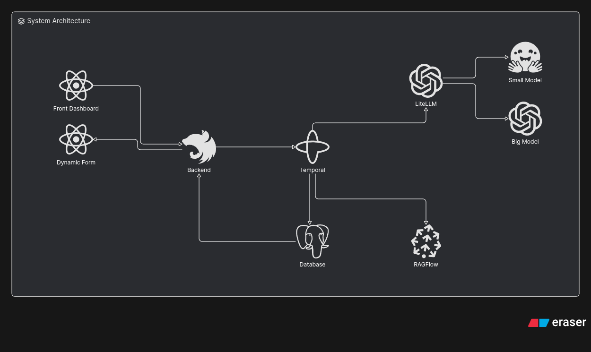
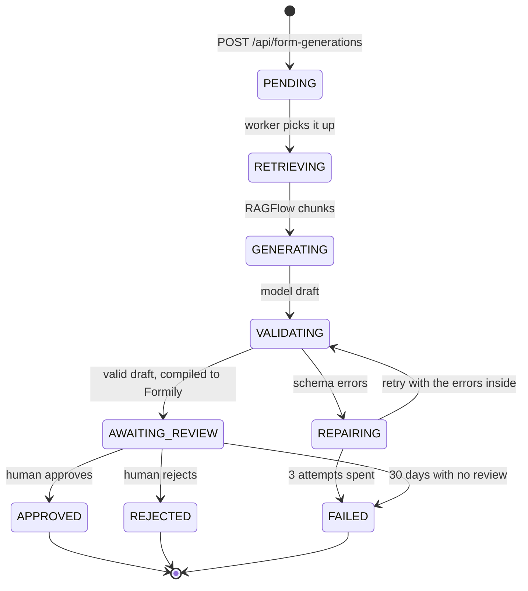
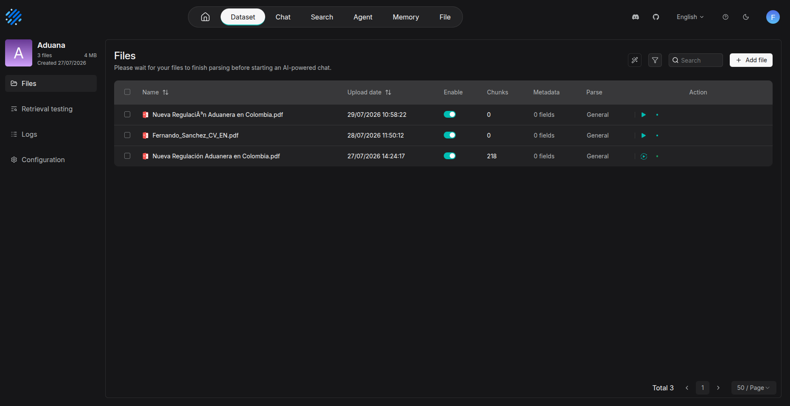
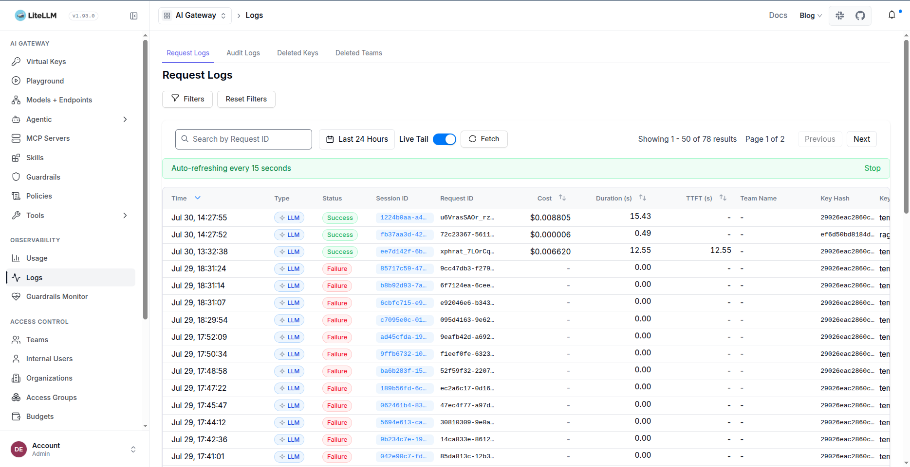
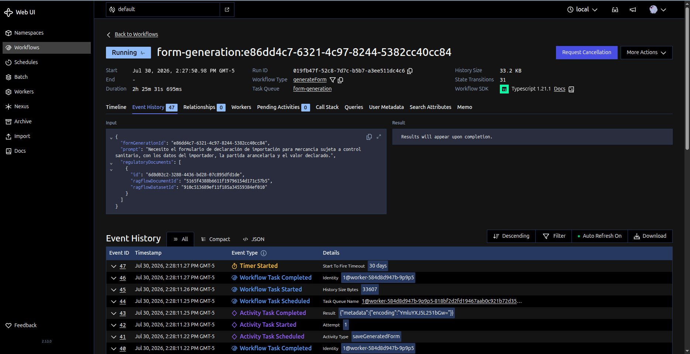
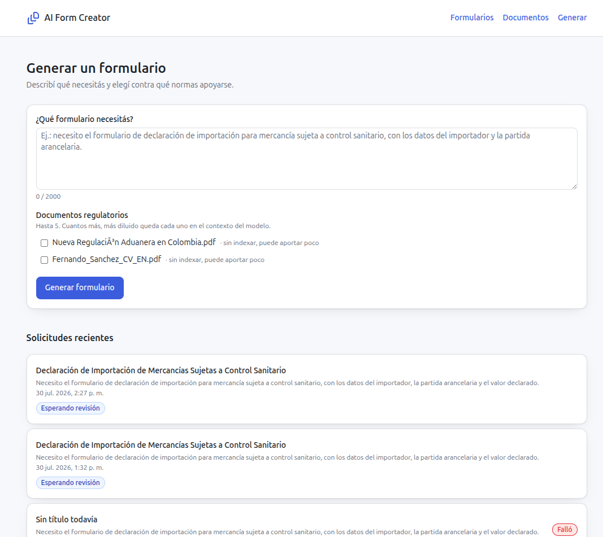

# AI Form Creator

Generates regulatory forms with AI, grounded on the regulations you upload, and
**never publishes one without a person approving it**.

You describe the form you need in plain language and pick which regulatory
documents it should lean on. A Temporal workflow retrieves the relevant chunks
from RAGFlow, asks a model for a draft over a closed field vocabulary, validates
that draft against a shared schema (retrying with the errors inside when it does
not fit), compiles it into Formily JSON and then **stops** and waits for a human
verdict. The screen follows the whole thing live over a WebSocket.

The result is stored twice — as a semantic draft and as a renderable schema —
so the same generation can be reviewed, rendered, filled in and audited without
anybody writing a component for it.

## System architecture



| Piece            | What it is                | What it is there for                                                    |
| ---------------- | ------------------------- | ----------------------------------------------------------------------- |
| Front Dashboard  | React 19 + Vite           | Requesting a generation, following it live, approving or rejecting it   |
| Dynamic Form     | Formily renderer          | Renders **any** generated schema — no component per form                |
| Backend          | NestJS, hexagonal         | Ingests documents, accepts requests, fans changes out over the WebSocket |
| Temporal         | Durable workflow + worker | Orchestrates the generation and survives restarts, retries and 30-day waits |
| LiteLLM          | Model proxy               | The only holder of provider keys; small model for embeddings, big model for generation |
| RAGFlow          | RAG over the PDFs         | Parses, chunks and indexes the regulations; answers retrieval queries   |
| Database         | Postgres                  | Requests, statuses, drafts, compiled schemas — and the `NOTIFY` feed    |

The arrows that matter and are easy to miss:

- **The back never writes a status.** It writes the `PENDING` row and enqueues.
  From there on, the only writer is the worker. The back finds out through
  Postgres `LISTEN`/`NOTIFY` and relays it over the WebSocket.
- **The worker never reads the database.** Everything it needs travels in the
  workflow argument, so the generation stays tied to the documents that existed
  at request time.
- **No API key ever reaches the browser.** The front talks to the back; only the
  worker and RAGFlow talk to LiteLLM, and only LiteLLM talks to the providers.

### The path of a generation



`AWAITING_REVIEW` is not a formality: the only transition towards `APPROVED`
starts there and a person triggers it. Three things hold that up — the
workflow's `condition`, the 409 of the `ReviewFormGeneration` use case, and the
back's repository port having no `update` at all.

---

# The AI architecture

Everything AI-shaped in this system is arranged around one problem: **a model
producing JSON is not the same as a system producing a form**. The model
contributes judgement — which data a regulation demands, what to call it,
whether it is mandatory. Everything else is mechanical, verifiable and
delegated to code, because code does not have a bad day.

That split shows up in five decisions, each with a file behind it.

## 1. What the model is asked for is not the format that gets rendered

The renderer eats Formily JSON: `x-decorator`, `x-component-props`, a `type`
per field, nested recursively. Asking a model for that is asking it to be
correct about a dozen mechanical details that are not business decisions — all
surface for mistakes, and every mistake costs a retry.

So the model is asked for a **draft** instead
([`packages/contracts/src/form-generation/generated-form.ts`](./packages/contracts/src/form-generation/generated-form.ts)):

```jsonc
{
  "title": "Import Declaration for Goods Subject to Sanitary Control",
  "description": "Filed by the importer before the goods arrive.",
  "fields": [
    {
      "name": "importerTaxId",           // from a closed enum
      "title": "Importer identification",
      "component": "TextField",           // from a closed enum
      "isRequired": true,
      "helpText": "",
      "placeholder": "900123456-7",
      "options": []
    }
  ]
}
```

and the worker compiles that into Formily
([`apps/worker/src/domain/to-formily-schema.ts`](./apps/worker/src/domain/to-formily-schema.ts)),
a pure function with a unit test. The value `type` is decided by the component,
not by the model: a `CheckboxField` stores a boolean and a `NumberField` a
number, always.

## 2. The field vocabulary is closed

This is the piece that makes what the AI generates *verifiable*
([`packages/contracts/src/form-generation/form-field-name.ts`](./packages/contracts/src/form-generation/form-field-name.ts)).
Without it the model would emit `company_name`, `legalName` and `companyName`
for the same thing, and no downstream consumer could read two forms with the
same code.

Today the vocabulary has **34 names in two groups**:

- **Compliance (cross-cutting, 18)** — `entityLegalName`, `entityTaxId`,
  `entityCountry`, `economicActivity`, `contactPersonName`, `contactEmail`,
  `regulationReference`, `obligationDescription`, `controlDescription`,
  `riskLevel`, `complianceStatus`, `evidenceDescription`, `responsibleParty`,
  `assessmentDate`, `effectiveDate`, `expirationDate`, `observations`,
  `declarationAccepted`.
- **Customs and foreign trade (16)** — `importerTaxId`, `exporterName`,
  `customsRegime`, `hsTariffCode`, `merchandiseDescription`, `originCountry`,
  `portOfEntry`, `transportMode`, `billOfLadingNumber`,
  `customsDeclarationNumber`, `declaredValue`, `currencyCode`, `grossWeightKg`,
  `packageCount`, `arrivalDate`, `dutiesPaid`.

Each one carries a description in `formFieldCatalog`, and **that description is
not documentation — it travels in the prompt**. It is the only thing the model
has in order to choose well. The catalogue is a `Record<FormFieldName, …>`, so
adding a name to the enum without describing it does not compile, and the
prompt is generated from the catalogue, so a new field shows up in the prompt
the same day it is added and not the day somebody remembers to update a
paragraph.

Seven components are accepted: `TextField`, `TextareaField`, `NumberField`,
`SelectField`, `CheckboxField`, `RadioGroupField`, `DateField`. Only the two
list-backed ones carry `options`, and for them they are mandatory.

## 3. The prompt is built from the contract, never by hand

[`apps/worker/src/domain/build-generation-prompt.ts`](./apps/worker/src/domain/build-generation-prompt.ts)
is a pure function: data in, two strings out. It is tested without a network.

- The **system message** states the role (regulatory compliance analyst), prints
  the vocabulary as a table generated from `formFieldCatalog`, lists the
  accepted components, and states the rules — between 1 and 25 fields, no
  repeated `name`, `isRequired` only when the regulation demands it, fields
  ordered the way they would be filled in.
- The **user message** carries the request verbatim, then the retrieved chunks
  under `## Regulatory sources` ("if they contradict the request, the chunks
  win"), and — only on a retry — the previous attempt's errors under
  `## Correction`, **last**, because it is what the model has freshest when it
  starts writing and the only thing separating this attempt from the failed one.

Limits like "at most 25 fields" are read from `generatedFormLimits`, so the
sentence in the prompt and the schema that enforces it cannot drift apart.

## 4. Retrieval is scoped to the documents the person picked



RAGFlow parses, chunks and indexes each uploaded PDF (that `Chunks` column is
how you tell an indexed document from one that will contribute nothing — the
front shows the same thing as *"not indexed, may contribute little"*).

At generation time
([`apps/worker/src/activities/ragflow-retrieval.ts`](./apps/worker/src/activities/ragflow-retrieval.ts)):

- the query is **the user's request as written** — it is what best describes
  what is being looked for;
- `document_ids` narrows the search to what the person chose, so a dataset with
  a hundred documents does not add noise from the ninety-five that are beside
  the point;
- `dataset_ids` is derived from the documents themselves, not from a configured
  default: what counts is where a document *is*, not where we expected it to be;
- `top_k: 8`, `similarity_threshold: 0.2` — more context is not better, it
  dilutes the ask;
- every chunk is returned **attributed to its document**. Without the
  attribution the model blends two regulations into one form with no way to
  tell them apart, and the reviewer cannot trace where a field came from.
- **zero chunks is not an error.** The documents may say nothing about what was
  asked, or may still be indexing. The form is generated anyway, with less
  backing — and the reviewer will notice.

Generating with **no documents at all** is also valid: you get a form leaning
only on the vocabulary and on the ask.

## 5. The model call goes through a proxy, with constrained decoding



LiteLLM exposes the OpenAI API and translates to the real provider, so
[`apps/worker/src/activities/litellm-client.ts`](./apps/worker/src/activities/litellm-client.ts)
speaks `chat/completions` without knowing whether Gemini, Claude or GPT is on
the other side. Switching models is changing `LITELLM_MODEL` — not a
deployment, not a code change. What the proxy buys:

- **One place for the provider keys.** The browser never sees one, the back
  never sees one, and RAGFlow's embeddings go through the same door.
- **Virtual keys per consumer.** The worker's key differs from RAGFlow's, so
  they rotate separately and the spend attributes itself (that `Key Hash`
  column above).
- **Cost and latency per request**, which is how you find out that a
  twenty-field form with RAG context inside costs $0.008 and takes 15 seconds —
  and how you notice a run of failures the moment a free-tier quota runs out.

The request itself:

- `temperature: 0.2` — low but **not zero**. Zero sounds right until the
  schema-error retry returns exactly the same invalid answer all three times.
- `response_format: { type: 'json_schema', strict: true }`, with the schema
  projected from the TypeBox contract by
  [`to-strict-json-schema.ts`](./apps/worker/src/domain/to-strict-json-schema.ts).
  That projection exists because `strict` mode is a narrow dialect: nothing
  optional, `additionalProperties: false` everywhere, no `format`, and
  `minItems`/`maxItems` stripped off arrays of objects because Gemini rejects
  the whole request with them.
- Structured output is used but **not trusted**: it moves the bulk of the work
  to whoever can do it with constrained decoding instead of to a retry loop,
  and the answer is validated afterwards anyway.
- Native `fetch`, no SDK: it is one call, and the OpenAI SDK would bring its own
  retry layer to compete with Temporal's.

## 6. Validation is three filters, and its output is written for the model

[`apps/worker/src/domain/validate-generated-form.ts`](./apps/worker/src/domain/validate-generated-form.ts)
is the gatekeeper: this is where it is decided whether what came back gets
stored or gets handed back for fixing.

1. **Is it JSON?** Models still wrap answers in ` ```json ` sometimes. That gets
   stripped rather than rejected — spending one of three attempts on something a
   `slice` fixes is throwing an attempt away.
2. **Does it meet the schema?** `Value.Check` against `generatedFormSchema` —
   the very same schema that travelled in `response_format`. `name` and
   `component` inside the enums, everything mandatory present, nothing extra.
3. **Does it meet what the schema cannot say?** JSON Schema cannot express
   "`options` is mandatory if and only if the component is a list", nor "the
   `name`s do not repeat". Without this third filter a `SelectField` with no
   options would be stored — one that validates perfectly and renders an empty
   dropdown.

Every rejection is phrased as an instruction, because that text is fed straight
back to the model:

```
At /fields/2/name: Expected union value. Received: "companyName".
The "customsRegime" field uses SelectField, which needs at least one option in `options`.
```

## 7. The repair loop lives in the workflow, not in a retry policy



Look at that screenshot: the workflow has been *running for 2h 25m*, its last
event is a **timer with a 30-day fire timeout**, and its whole input — prompt,
document ids, RAGFlow ids — is recorded in the history. That is the thing
Temporal contributes and that cannot be obtained any other way: the retry loop,
the wait for a human signature and the status of every request survive the pod
restarting, being replaced or dying halfway.

The loop itself
([`generate-form.workflow.ts`](./apps/worker/src/workflows/generate-form.workflow.ts)):

```
for attempt in 1..3
    mark GENERATING (first) | REPAIRING (rest)
    raw = requestFormDraft(prompt, chunks, problems)   ← 5 min timeout
    mark VALIDATING
    validation = validateFormDraft(raw)                 ← an activity, on purpose
    if valid → save + AWAITING_REVIEW
    problems = validation.problems                      ← next prompt carries them
```

Four decisions worth naming:

- **Three attempts and no more.** The first retry with the errors inside fixes
  almost everything that gets fixed. If the third still fails, the problem is
  the request, the vocabulary or the prompt — none of which is fixed by
  insisting.
- **This is not Temporal's retry policy.** That one re-executes the same
  activity with the same arguments, which at a low temperature returns almost
  the same invalid answer. Here the arguments change: the errors go in. The
  Temporal retry (2 s, ×2 backoff, 3 attempts) is still there, for *transport*
  failures — LiteLLM not answering, the network dropping.
- **`validateFormDraft` is an activity even though it is a pure function.** The
  workflow may wait 30 days for a human, and in 30 days new code gets deployed;
  a pure function that decides a workflow path could then change its mind on
  re-execution and blow up with a `Nondeterminism error`. An activity's result
  is recorded in the history and re-read, not recomputed.
- **`GENERATING` and `REPAIRING` are different statuses** because to whoever is
  watching the screen they mean different things: *"this is taking a while"* vs.
  *"this is having trouble"*.

Timeouts are split per activity kind — 30 s for the Postgres writes, 1 min for
retrieval, 5 min for the model call — so a hung database write is not discovered
five minutes late.

## 8. The AI never publishes on its own

Every generation halts at `AWAITING_REVIEW`. What the reviewer approves is not a
summary of the form: it is **the form itself, rendered by the same `DynamicForm`
component that end users will fill in**, with an optional note attached to the
verdict.

The verdict travels as a Temporal signal, and the worker — not the back — writes
the final status. Approve or reject, the row keeps the reviewer's note and the
timestamp.

---

# How a form is generated, end to end



> Screenshot captured before the repo-wide English pass; the UI copy now reads
> in English.

1. **Someone describes what they need** (10–2000 characters) and ticks up to
   **5** regulatory documents. The cap is not arbitrary: each document adds
   chunks to the context and past a point the model starts ignoring the ones in
   the middle. Documents that are not indexed yet are flagged as such — they can
   be picked, they will just contribute little.
2. **`POST /api/form-generations`** — the back validates the prompt limits,
   checks every document id exists, writes the row as `PENDING`, starts the
   `generateForm` workflow on the `form-generation` queue and answers **202**
   without waiting for the model.
3. **`RETRIEVING`** — the worker queries RAGFlow, scoped to those documents.
4. **`GENERATING`** — LiteLLM, structured output, the prompt built from the
   contract.
5. **`VALIDATING`** — three filters.
6. **`REPAIRING`** — up to twice more, each time with the errors written into the
   prompt.
7. **`AWAITING_REVIEW`** — draft + compiled Formily schema + status are written
   in **a single `UPDATE`**. Two statements would leave an instant where the
   schema is stored under the old status, and since the status change is what
   fires the `NOTIFY`, the front could be told to render a schema that is not
   there yet.
8. **A person approves or rejects.** `POST /api/form-generations/:id/review`
   delivers the signal and answers **204** — the final status is written by the
   worker and arrives on its own.
9. **`APPROVED` / `REJECTED` / `FAILED`.**

Every status change follows the same road back to the screen:

```
UPDATE form_generations ─► trigger ─► pg_notify ─► back (LISTEN) ─► WebSocket ─► front
```

The `pg_notify` payload carries **only the id and the status**, not the row: the
payload has a hard 8 KB cap and a Formily schema goes over it with any
medium-sized form. The back re-reads by id and publishes the already-mapped
entity. The REST `GET`s still exist and are not redundant — the socket brings
changes *from the moment you connected*, and the screen needs a starting point
(and a safety net if the socket never connects).

---

# How the forms are persisted

Two tables, and every column in them is there for a reason
([`apps/back/prisma/schema.prisma`](./apps/back/prisma/schema.prisma)).

### `form_generations` — the request and everything the pipeline piled on it

| Column                    | What it holds                                                     |
| ------------------------- | ------------------------------------------------------------------ |
| `prompt`                  | The ask, exactly as the person wrote it                            |
| `regulatory_document_ids` | `UUID[]` — the documents chosen, as a **snapshot**                  |
| `status`, `attempts`      | Where it is, and how many times the model was asked                |
| `draft` (jsonb)           | The model output that passed validation — the **semantic** form    |
| `formily_schema` (jsonb)  | The compiled draft — the **renderable** form                       |
| `failure_reason`          | Why it fell over, in plain words                                   |
| `reviewer_note`, `reviewed_at` | Who decided what, and when                                    |
| `created_at`, `updated_at` | Indexed together with `status` for the list screen                |

**Why two representations of the same form.** They are not redundant, they
answer different questions:

- `formily_schema` answers *"how is this drawn?"*. It is what the front renders,
  and it is format-coupled: change the renderer, and this is what has to be
  recompiled.
- `draft` answers *"what is this form asking for?"*. Its field names come from
  the closed vocabulary, so a downstream consumer can read `entityTaxId` across
  every form ever generated without knowing anything about Formily. Reporting,
  prefilling, mapping to a government API, diffing two versions of a
  regulation's form — all of that reads `draft`, not the compiled schema.

The compiled schema can always be rebuilt from the draft by re-running a pure
function. The draft cannot be rebuilt from anything.

**Why `regulatory_document_ids` is an array and not a join table.** This is the
snapshot of a request, not a live relation. If a document is deleted tomorrow,
what was generated that day has to remain explainable with what existed that day
— and a foreign key with `ON DELETE CASCADE` would take exactly that evidence
away. Together with `prompt`, `attempts`, `draft` and `reviewer_note`, the row is
a self-contained audit trail: *this text, against these documents, produced this
form, in this many tries, and this person signed it off.*

### `regulatory_documents` — what the forms are grounded on

The file itself lives in RAGFlow's MinIO; this table keeps the pointer
(`ragflow_document_id`, unique, plus its `ragflow_dataset_id`), the metadata
(`file_name`, `mime_type`, `size_bytes`) and the ingestion status
(`PENDING → PROCESSING → INDEXED → FAILED`).

### What is *not* there yet

The `/forms` catalogue — listing published forms and submitting responses — is
served by **MSW mocks** today; there is no `form-templates` controller in the
back, and no promotion step turning an `APPROVED` generation into a published
template with its own responses table. The renderer, the contract and the stored
`formily_schema` are all in place; what is missing is the table and the two
endpoints. Run the front with `VITE_APP_ENABLE_API_MOCKING=true` to see that
half of the product working end to end.

---

# What you can build with it

The system is not "a customs form generator". It is a pipeline that turns
*regulation + request* into *validated, renderable, auditable form*, and the
domain is decided by two things: the PDFs you upload and the vocabulary in
`formFieldCatalog`. The compliance group is cross-cutting on purpose — it
covers a surprising share of the scenarios below on its own.

| Scenario                      | The prompt you would write                                                                  | Documents you would upload                | Vocabulary                       |
| ----------------------------- | ------------------------------------------------------------------------------------------- | ----------------------------------------- | -------------------------------- |
| **Customer / supplier onboarding** | "Onboarding form for a new supplier: legal identity, activity, contact and sworn declaration" | Internal onboarding policy                | Compliance group, as-is          |
| **KYC / AML**                 | "Know-your-customer form for a legal entity opening an account, with risk classification"     | AML regulation, sanctions circular        | + beneficial owner, PEP status   |
| **Information request (RFI)** | "Form to request evidence of the controls a vendor has in place for our annual review"        | The vendor questionnaire standard         | Compliance group, as-is          |
| **Compliance attestation**    | "Quarterly attestation form: obligation, implemented control, status, evidence, responsible"  | The regulation being attested             | Compliance group, as-is          |
| **Customs declaration**       | "Import declaration for goods subject to sanitary control, with importer, HS code and value"  | The customs regulation                    | Customs group, as-is             |
| **Permit / licence renewal**  | "Renewal form for an operating licence, with effective and expiry dates and the declaration"  | The licensing resolution                  | Compliance group, as-is          |
| **Incident / breach report**  | "Form to report a personal-data breach to the authority within the legal deadline"            | The data-protection law                   | + incident date, affected count  |
| **Audit evidence collection** | "Form the auditee fills in per finding: control, evidence, responsible area, remediation date" | Audit programme, the applicable standard | Compliance group, as-is          |
| **ESG / sustainability**      | "Annual emissions and social-indicators reporting form for a mid-sized company"               | The reporting standard (e.g. a CSRD annex)| + emissions scope, units         |
| **Data subject request (DSAR)** | "Form for a person to exercise access, rectification or deletion of their data"              | The privacy regulation                    | + request type, identity proof   |
| **Product safety / adverse events** | "Adverse-event report form for a medical device, with severity and traceability"        | The pharmacovigilance guideline           | + batch number, severity         |
| **Grant / subsidy application** | "Application form for an export subsidy, with the eligibility declarations"                  | The call for applications                 | Compliance + customs             |

The rows marked *"as-is"* work today with nothing but a PDF and a sentence. The
rest need what is honestly the extension mechanism of this product:

**Adding a domain = adding rows to the vocabulary, not writing code.** A new
field is one entry in `formFieldNames`, one description in `formFieldCatalog`
(which will not compile without it) — and from that moment it is in the prompt,
in the structured-output enum, in the validator and in the front. Only a field
that needs a *new kind of control* (a slider, a file upload) touches React:
constant in `packages/contracts` → component in `features/dynamic-form/fields/`
→ one entry in the `SchemaField` map. Three files, nothing else.

And in the other direction: because every form's fields come from the same
closed list, forms generated for different scenarios are **mutually readable**.
An `entityTaxId` collected in an onboarding form is the same key as the
`entityTaxId` in a compliance attestation, which is what makes prefilling,
cross-scenario reporting and mapping to an external API possible at all.

---

## Packages

| Package                                      | What it is                                                                                                                                                                                            |
| -------------------------------------------- | ----------------------------------------------------------------------------------------------------------------------------------------------------------------------------------------------------- |
| [`apps/front`](./apps/front)                 | React 19 + Vite 8. Dynamic forms from JSON Schema with [Formily](https://formilyjs.org/), [bulletproof-react](https://github.com/alan2207/bulletproof-react/tree/master/apps/react-vite) architecture    |
| [`apps/back`](./apps/back)                   | NestJS + Prisma + Postgres. Document ingestion, generation requests, WebSocket fan-out. Hexagonal architecture                                                                                          |
| [`apps/worker`](./apps/worker)               | Temporal worker. The only process talking to the model and the only one moving a generation's status                                                                                                   |
| [`packages/contracts`](./packages/contracts) | TypeBox schemas that cross the wire — HTTP, the Temporal queue, the WebSocket **and the model's response format**. One definition, four consumers                                                       |

All four architectures are **enforced by ESLint**: breaking them fails the lint
and blocks the commit. The coding rules (naming, magic strings, design tokens,
variant mapping) are in [`CLAUDE.md`](./CLAUDE.md). Infrastructure lives in
[`iac/`](./iac/README.md), and the local RAGFlow stack in
[`RAGFLOW-STARTUP.md`](./RAGFLOW-STARTUP.md).

## Running it locally

### 0. Compile the contracts (always first)

The apps type against the package's `dist/`, which is not committed. In a fresh
clone, nothing else compiles until this runs:

```bash
cd packages/contracts
npm install
npm run build
```

### 1. Front only, no backend (the fastest way in)

The API is mocked with MSW, including a simulated generation pipeline that walks
through every status. Enough to work on the whole UI:

```bash
cd apps/front
cp .env.example .env      # VITE_APP_ENABLE_API_MOCKING=true
npm install
npm run dev               # http://localhost:3000
```

Routes: `/`, `/forms`, `/forms/:formTemplateId`, `/regulatory-documents`,
`/form-generations`, `/form-generations/:formGenerationId`.

### 2. The full stack

Four dependencies have to be reachable: Postgres, Temporal, LiteLLM and RAGFlow.
The cluster in [`iac/`](./iac/README.md) runs all four; locally the practical
route is to port-forward the ones that are already deployed and bring RAGFlow up
from its own Docker Compose checkout.

```bash
# Postgres, Temporal and LiteLLM from the cluster
kubectl -n ai-form-creator port-forward svc/app-postgres    5432:5432 &
kubectl -n ai-form-creator port-forward svc/temporal-server 7233:7233 &
kubectl -n ai-form-creator port-forward svc/litellm         4000:4000 &

# RAGFlow from the local checkout — see RAGFLOW-STARTUP.md
cd ragflow/ragflow/docker && docker compose -f docker-compose.yml up -d
```

Then the backend, in its own terminal:

```bash
cd apps/back
cp .env.example .env      # fill in the credentials
npm install
npm run db:deploy         # applies the migrations
npm run dev               # http://localhost:8080 — Swagger at /docs
```

And the worker, in another one:

```bash
cd apps/worker
cp .env.example .env      # LITELLM_API_KEY, LITELLM_MODEL, RAGFLOW_API_KEY, DATABASE_URL
npm install
npm run dev               # it listens on no port: it takes work from the queue
```

Finally, point the front at the real backend:

```bash
cd apps/front
# in .env:
#   VITE_APP_API_URL=http://localhost:8080/api
#   VITE_APP_ENABLE_API_MOCKING=false
npm run dev
```

Switching model is `LITELLM_MODEL` in the worker's `.env`
(`gemini/gemini-flash-latest`, `anthropic/claude-sonnet-5`, `openai/gpt-…`) —
LiteLLM routes by prefix and holds every provider key.

To watch what a generation is doing when it gets stuck, the Temporal UI is the
place: `kubectl -n ai-form-creator port-forward svc/temporal-ui-svc 8080:8080`.
The event history shows the exact input, every activity attempt and the pending
timer, which is how the screenshot further up was taken.

### Ports at a glance

| Service          | Local port | In the cluster          |
| ---------------- | ---------- | ----------------------- |
| Front (Vite)     | 3000       | `front` behind Traefik  |
| Back (Nest)      | 8080       | `back:80`, path `/api`  |
| Postgres (app)   | 5432       | `app-postgres:5432`     |
| Temporal         | 7233       | `temporal-server:7233`  |
| LiteLLM          | 4000       | `litellm:4000`          |
| RAGFlow API      | 9380       | `ragflow:9380`          |
| RAGFlow UI       | 9797       | `ragflow` (Ingress)     |

## Commands

Every package exposes the same set. Run them from the package folder:

| Command               | What it does                              |
| --------------------- | ----------------------------------------- |
| `npm run dev`         | development server / worker in watch mode |
| `npm run lint`        | ESLint (architecture, naming, tokens)     |
| `npm run lint:fix`    | ESLint + Prettier autofix                 |
| `npm run check-types` | `tsc`                                     |
| `npm test`            | Vitest (front) / Jest (back, worker)      |
| `npm run build`       | production build                          |

Front only: `npm run generate` (Plop scaffolding for a feature/component).
Back only: `npm run db:migrate | db:deploy | db:studio`.

Git hooks (husky): `pre-commit` runs lint-staged; `pre-push` runs types + tests
across all four packages, with the contracts rebuilt first.

## Stack

| Layer            | Choice                                             |
| ---------------- | -------------------------------------------------- |
| Build (front)    | Vite 8 + `@vitejs/plugin-react`                    |
| Forms            | `@formily/core` + `@formily/react` (schema-driven) |
| Data (front)     | TanStack Query 5 + axios + socket.io-client        |
| Routing          | react-router 8 (`createBrowserRouter`, lazy)       |
| Styling          | Tailwind v4 (design tokens in `@theme`) + CVA      |
| Global state     | Zustand (notifications only, for now)              |
| API              | NestJS 11 + Prisma 6 + Postgres                    |
| Orchestration    | Temporal (durable workflows, 30-day waits)         |
| Models           | LiteLLM as a proxy (OpenAI-compatible API)         |
| RAG              | RAGFlow (MySQL + Elasticsearch + MinIO + Redis)    |
| Contracts        | TypeBox (`Static<>` types + runtime schemas)       |
| Env validation   | Zod                                                |
| Mocks            | MSW (dev + tests)                                  |
| Quality          | ESLint 9 flat config, Prettier, Vitest/Jest, husky |
| Infrastructure   | Kustomize over k3s (see [`iac/`](./iac/README.md)) |

## How the architecture is enforced

`eslint.config.js` reads `src/features/` **from disk** and generates the
restricted zones, so every new feature is isolated automatically:

- `import-x/no-restricted-paths` + `no-restricted-imports`: they forbid imports
  between features and guarantee the `shared → features → app` flow.
- `check-file/*`: files and folders in `kebab-case`.
- `@typescript-eslint/naming-convention`: camelCase/PascalCase/UPPER_CASE.
- `no-restricted-syntax`: forbids comparing against string literals, literal
  routes in `<Link to>`, literal storage keys and `import.meta.env` outside
  `src/config`.
- `@typescript-eslint/no-magic-numbers`: numbers go to `config/`.

The back and the worker have their own equivalents: dependencies pointing
inwards (`domain` ← `application` ← `infrastructure`) and, in the worker, the
ban on `workflows/` touching activities, config or any Node module — the
deterministic sandbox would break in production, not at compile time.

A real example of what the lint rejects:

```
error  Unexpected path "../../dynamic-form/utils/…" imported in restricted zone.
       Imports between features are not allowed.        import-x/no-restricted-paths
error  Magic string: compare against a named constant.        no-restricted-syntax
error  The filename "Bad-Example.tsx" does not match KEBAB_CASE.
                                        check-file/filename-naming-convention
```

---

# Complete example: the `dynamic-form` feature

This is the reference feature. It renders **any** form out of the JSON Schema
the API returns: there is no component per form, there is one renderer and a
catalogue of fields. It is what draws the review preview and what would draw a
published form.

```
src/features/dynamic-form/
├── api/
│   ├── get-form-templates.ts      # list    (queryOptions + hook)
│   ├── get-form-template.ts       # detail  (includes the schema)
│   └── submit-form-response.ts    # submission mutation
├── components/
│   ├── dynamic-form.tsx           # renderer: createForm + FormProvider + SchemaField
│   ├── schema-field.tsx           # Variant Mapping: 'TextField' → <TextField/>
│   ├── form-item.tsx              # decorator: label, required, help, errors
│   ├── form-status-badge.tsx
│   ├── form-templates-list.tsx
│   ├── form-template-detail.tsx   # composes query + renderer + mutation
│   ├── fields/                    # controls connected to Formily
│   │   ├── field-styles.ts        # shared CVA (tokens)
│   │   ├── text-field.tsx  textarea-field.tsx  number-field.tsx
│   │   ├── select-field.tsx  radio-group-field.tsx
│   │   ├── checkbox-field.tsx  date-field.tsx
│   └── __tests__/dynamic-form.test.tsx
├── config/
│   ├── api-endpoints.ts           # URLs + query keys (zero literals outside)
│   ├── field-components.ts        # `x-component` names (the contract)
│   ├── form-status.ts             # status Variant Mapping
│   └── validation-locale.ts       # validation messages
├── types/form-template.ts
└── utils/normalize-form-values.ts
```

## Step by step: how it was built (and how to build the next one)

### 0. Generate the skeleton

```bash
npm run generate      # → feature → name: dynamic-form, entity: form-template
```

It leaves `config/api-endpoints.ts`, `types/`, `api/` and a list component
created and already formatted. From that moment on ESLint stops another feature
from importing it.

### 1. Types: the contract with the backend (`types/form-template.ts`)

The schema is data, not code. It is typed with Formily's `ISchema`:

```ts
import type { ISchema } from '@formily/react';

export const formTemplateStatuses = {
  draft: 'draft',
  published: 'published',
  archived: 'archived',
} as const;
export type FormTemplateStatus =
  (typeof formTemplateStatuses)[keyof typeof formTemplateStatuses];

export type FormTemplate = FormTemplateSummary & { schema: ISchema };
```

> The statuses are declared as an `as const` object, not as a union of loose
> strings: that way `formTemplateStatuses.published` replaces `'published'`
> everywhere and the lint can forbid the literal comparison.

### 2. Centralized configuration (`config/`)

No URLs and no component names scattered around:

```ts
// config/api-endpoints.ts
export const dynamicFormEndpoints = {
  formTemplates: '/form-templates',
  formTemplate: (id: string) => `/form-templates/${id}`,
  formResponses: (id: string) => `/form-templates/${id}/responses`,
} as const;

export const dynamicFormQueryKeys = {
  all: ['form-templates'] as const,
  lists: () => [...dynamicFormQueryKeys.all, 'list'] as const,
  detail: (id: string) => [...dynamicFormQueryKeys.all, 'detail', id] as const,
} as const;
```

```ts
// config/field-components.ts — the contract between the JSON and React.
// The list itself lives in packages/contracts: since the AI is the one
// choosing the `x-component`, these are literals crossing the wire.
export const formFieldComponents = {
  text: 'TextField',
  textarea: 'TextareaField',
  number: 'NumberField',
  select: 'SelectField',
  checkbox: 'CheckboxField',
  radioGroup: 'RadioGroupField',
  date: 'DateField',
} as const;
```

### 3. API layer (`api/`)

One file per operation; pure function + `queryOptions` + hook:

```ts
export const getFormTemplate = (
  formTemplateId: string,
): Promise<FormTemplate> =>
  api.get(dynamicFormEndpoints.formTemplate(formTemplateId));

export const getFormTemplateQueryOptions = (formTemplateId: string) =>
  queryOptions({
    queryKey: dynamicFormQueryKeys.detail(formTemplateId),
    queryFn: () => getFormTemplate(formTemplateId),
  });

export const useFormTemplate = ({
  formTemplateId,
  queryConfig,
}: UseFormTemplateOptions) =>
  useQuery({ ...getFormTemplateQueryOptions(formTemplateId), ...queryConfig });
```

Separating the function from its hook allows preloading from a route
`clientLoader` (`src/app/routes/forms/forms.tsx` does exactly that).

### 4. The fields: connecting our own components to Formily (`components/fields/`)

Formily imposes no UI library. `connect` injects `value`, `onChange`,
`disabled`; `mapProps` translates field state into component props:

```tsx
const TextInput = ({ value, invalid, className, ...props }: TextInputProps) => (
  <input
    type="text"
    value={value ?? ''}
    className={cn(controlVariants({ invalid }), className)}
    {...props}
  />
);

export const TextField = connect(
  TextInput,
  mapProps((props, field) => ({
    ...props,
    invalid: Boolean('selfErrors' in field && field.selfErrors?.length),
  })),
);
```

Details already solved:

- `select`: `mapProps({ dataSource: 'options' })` turns the JSON Schema `enum`
  into the `options` of the `<select>`.
- `checkbox`: Formily reads `event.target.value` (which on a native checkbox is
  `"on"`), so the component emits the boolean explicitly.
- Styles: everything comes from `controlVariants` (CVA + design tokens), no raw
  values.

### 5. The `FormItem` decorator (`components/form-item.tsx`)

It wraps every field with a label, a required marker, help and errors, reading
the field's reactive state:

```tsx
export const FormItem = observer(({ children, help, className }: FormItemProps) => {
  const field = useField<Field>();
  const errors = field.selfErrors ?? [];
  …
});
```

### 6. Variant Mapping of the renderer (`components/schema-field.tsx`)

The only place where a schema string becomes a component. No `switch`, no `if`:

```tsx
export const SchemaField = createSchemaField({
  components: {
    [formFieldDecorators.formItem]: FormItem,
    [formFieldComponents.text]: TextField,
    [formFieldComponents.select]: SelectField,
    …
  },
});
```

**Adding a new field type** (a slider, say) = 3 steps, touching nothing else:
constant in `packages/contracts` → component in `fields/` → entry in this map.

### 7. The renderer (`components/dynamic-form.tsx`)

```tsx
export const DynamicForm = ({
  schema,
  initialValues,
  isDisabled,
  onSubmit,
}: DynamicFormProps) => {
  const form = useMemo(
    () => createForm({ initialValues, editable: !isDisabled }),
    [initialValues, isDisabled],
  );

  const handleSubmit = () => {
    form.submit<FormValues>(onSubmit).catch(() => undefined); // validates before calling
  };

  return (
    <FormProvider form={form}>
      <SchemaField schema={schema} />
      <Button
        onClick={handleSubmit}
        isLoading={isSubmitting}
        disabled={isDisabled}
      >
        …
      </Button>
    </FormProvider>
  );
};
```

It knows no concrete field: it is reusable for any schema. The generation review
screen renders the very same component in preview mode — what a reviewer
approves is the form itself, not a description of it.

### 8. Composition with data (`components/form-template-detail.tsx`)

It joins query + renderer + mutation, and uses the status Variant Mapping to
decide whether the form can be submitted:

```tsx
const statusVariant = formStatusVariants[formTemplate.status];

<DynamicForm
  schema={formTemplate.schema}
  isDisabled={!statusVariant.isSubmittable}
  isSubmitting={submitFormResponse.isPending}
  onSubmit={(values) =>
    submitFormResponse.mutate({
      formTemplateId,
      values: normalizeFormValues(values),
    })
  }
/>;
```

### 9. Wiring the feature into the app (the `app/` layer)

`src/config/paths.ts`:

```ts
forms: {
  root:   { path: '/forms', getHref: () => '/forms' },
  detail: { path: '/forms/:formTemplateId',
            getHref: (id: string) => `/forms/${id}` },
},
```

`src/app/routes/forms/form.tsx` — the route is what imports the feature (never
the other way around):

```tsx
const FormRoute = () => {
  const { formTemplateId } = useParams<{ formTemplateId: string }>();
  if (!formTemplateId) return null;
  return (
    <AppLayout>
      <FormTemplateDetail formTemplateId={formTemplateId} />
    </AppLayout>
  );
};
export default FormRoute;
```

and it is registered in `src/app/router.tsx` with
`lazy: () => import('./routes/forms/form')`.

### 10. Mocks and tests

`src/testing/mocks/data/form-templates.ts` defines the sample schemas
(onboarding, NPS survey, draft) and `handlers/form-templates.ts` serves the
endpoints. The same handlers feed Vitest, so the tests exercise the real API
layer:

```tsx
it('does not submit if a required field is missing', async () => {
  const onSubmit = vi.fn();
  const { user } = renderApp(
    <DynamicForm schema={schema} onSubmit={onSubmit} />,
  );

  await user.click(await screen.findByRole('button', { name: 'Submit' }));

  expect(await screen.findByRole('alert')).toBeInTheDocument();
  expect(onSubmit).not.toHaveBeenCalled();
});
```

## Example of a schema the app consumes

This is what comes out of the compiler — `formily_schema` in the database, and
what the renderer eats:

```jsonc
{
  "type": "object",
  "properties": {
    "contactEmail": {
      "type": "string",
      "title": "Contact email",
      "required": true,
      "x-validator": "email",
      "x-decorator": "FormItem",
      "x-decorator-props": { "help": "We will use this address for access." },
      "x-component": "TextField",
      "x-component-props": { "placeholder": "ada@company.com" },
    },
    "customsRegime": {
      "type": "string",
      "title": "Customs regime",
      "required": true,
      "enum": [
        { "label": "Definitive import", "value": "definitive" },
        { "label": "Temporary admission", "value": "temporary" },
      ],
      "x-decorator": "FormItem",
      "x-component": "SelectField",
    },
  },
}
```

Adding a new form to the product **requires no code**: a new schema is enough,
and the AI generates it. Code only gets written when a field type that does not
exist yet shows up.

## License

[Apache License 2.0](./LICENSE) — Copyright 2026 Fernando Sanchez.
